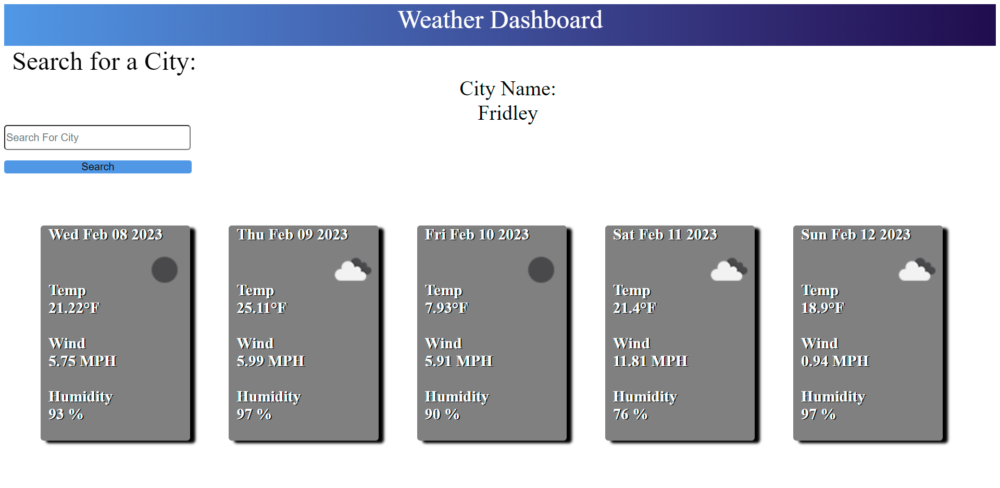

# 06 Weather Dashboard

https://htranchung.github.io/Weather-Dashboard/

 

## Description

- Weather Dashboard
- Calls Weather API to fetch data
- Shows Temp of searched city
- Shows Wind in MPH of searched city
- Shows Humidity % of searched city
- When searched city is searched weather icon will appear 

## Usage

When a city is searched, the weather to that city will appear and show temp, wind, humidity, and show an icon of what weather is like. The name of the city will then appear under city name:

## Credits
https://openweathermap.org/api 
>
